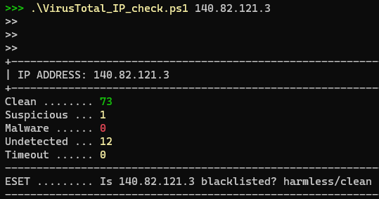
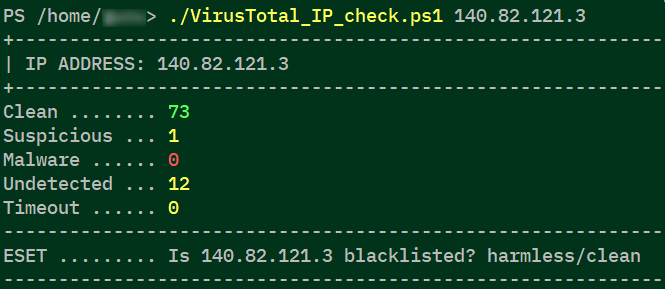

# VirusTotal IP check


## Check the reputation of an IP address using Powershell and VirusTotal API key






## WHAT

A small pwsh script to check an overall reputation of an IP address using Powershell and VirusTotal. It also checks one (or more) particular antivirus engine's result (in this example, ESET).


## WHY

A short pwsh excersise for something I use regularly.


## WHERE

Tested on:

+ Windows 10 with Powershell 7
+ Windows 10 with Powershell 5
+ Ubuntu 21.04 with Powershell 7
+ did not test with older versions of Powershell


## HOW

### Prerequisites:

+ Powershell 5 or 7
+ [VirusTotal API key](https://developers.virustotal.com/v3.0/reference#getting-started)

### Run

First, implement your VT API key. Originally, script makes use of environment variable "zzVirusTotalAPI":

```powershell
$swVTFileReportWR = Invoke-WebRequest -Method GET -Uri "https://www.virustotal.com/api/v3/ip_addresses/$args" -Headers @{"x-apikey"="$Env:zzVirusTotalAPI"}
```

If you don't like the idea - hardcode API key:

```powershell
$swVTFileReportWR = Invoke-WebRequest -Method GET -Uri "https://www.virustotal.com/api/v3/ip_addresses/$args" -Headers @{"x-apikey"="abcd1234efgh5678ijkl...blabla"}
```

After that, run the script and give it an argument:

```bash
VirusTotal_IP_check.ps1 140.82.121.3
```

### Error management

There is no error management, ain't noone got a time for that.
Script expects an argument from command line and it should be an IP address.
If it's not or there is not - who knows what will be.

### ToDo

Nothing much if anything. It does what's expected - return a reputation.


## WHEN, WHO

```
VirusTotal_IP_check.PS1 v.21.0824.07
(C)2021 SomwareHR
https://github.com/SomwareHR
License: MIT
[SWID#20210824064501]
```
